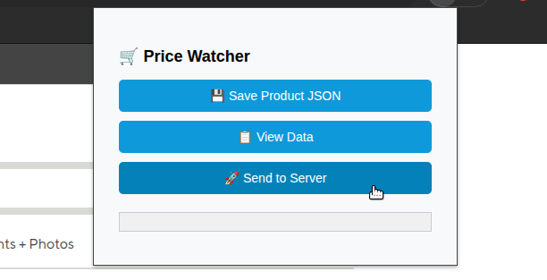

#### Chrome Extension

See price-tracker-extension/ folder. Load it in Chrome via:

    chrome://extensions/

    Enable Developer Mode

    Click "Load unpacked" and select the folder.

#### Backend Setup (Python)

1. Create virtual environment:
```bash
  python -m venv .venv
  source .venv/bin/activate
```
2. Install dependencies:
```bash
  pip install -r requirements.txt
```

2. Start the server:
```bash
  python backend/server.py
```

#### Install llama.cpp
```bash
git clone https://github.com/ggerganov/llama.cpp.git

cd ~/Documents/projs/llama.cpp/build/bin/ && cmake -DLLAMA_CURL=OFF .. && make

~/Documents/projs/llama.cpp/build/bin/llama-cli --help
```

```bash
cd && mkdir models && cd models

# tinyllama-1.1b-chat-v1.0.Q4_K_M.gguf - ~638MB
curl -LO https://huggingface.co/TheBloke/TinyLlama-1.1B-Chat-v1.0-GGUF/resolve/main/tinyllama-1.1b-chat-v1.0.Q4_K_M.gguf

# mistral-7b-instruct-v0.1.Q4_K_M.gguf- ~ 4167MB
curl -L -o mistral-7b-instruct-v0.1.Q4_K_M.gguf \
  https://huggingface.co/TheBloke/Mistral-7B-Instruct-v0.1-GGUF/resolve/main/mistral-7b-instruct-v0.1.Q4_K_M.gguf
```

#### Change server.py paths to paths where llama.cpp and your models are:
```bash
"/home/maxp/Documents/projs/llama.cpp/build/bin/llama-cli",
"-m", "/home/maxp/models/tinyllama-1.1b-chat-v1.0.Q4_K_M.gguf",
..
```

#### Use
1. Start the server
```bash
price_watcher$ python backend/server.py
```
2. Open a page with a product, and click "Send to Server"


```bash
(.venv) maxp@maxp-ubuntud:~/Documents/projs/price_watcher$ python backend/server.py 
INFO:     Started server process [166415]
INFO:     Waiting for application startup.
INFO:     Application startup complete.
INFO:     Uvicorn running on http://127.0.0.1:8000 (Press CTRL+C to quit)
INFO:     127.0.0.1:60300 - "OPTIONS /extract HTTP/1.1" 200 OK
CWD: /home/maxp/Documents/projs/price_watcher

>>>>>>
YOU SHOULD SEE DETAILS OF WHAT WAS SENT TO THE SERVER HER....
<<<<<<

LLAMA CLI path: /home/maxp/Documents/projs/llama.cpp/build/bin/llama-cli
INFO:     127.0.0.1:60304 - "POST /extract HTTP/1.1" 200 OK
```